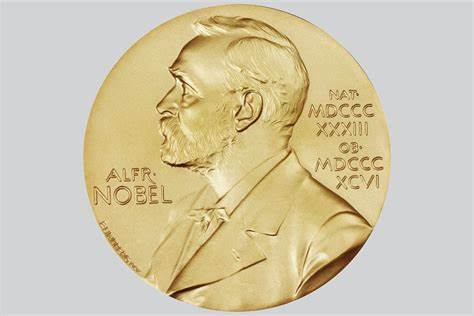

# A Visual History of Nobel Prize Winners

## Project Description

Welcome to the **A Visual History of Nobel Prize Winners** project! 🏆🌍

The Nobel Prize stands as a beacon of scientific and academic achievement across various fields. With laureates honored in chemistry, literature, physics, medicine, economics, and peace, the Nobel Prize's legacy spans decades. From its origins to the present day, this project dives into the characteristics of the recipients, countries leading in laureates, and remarkable individuals who have achieved the distinction of winning the prize multiple times.

Dating back to its inception in 1901, the Nobel Prize's journey reflects a global pursuit of excellence. While the prize's early history may have been Eurocentric and male-focused, its evolution over the years has sought to be unbiased and inclusive. But do the data reveal the full story? Let's explore and unveil the insights together.
